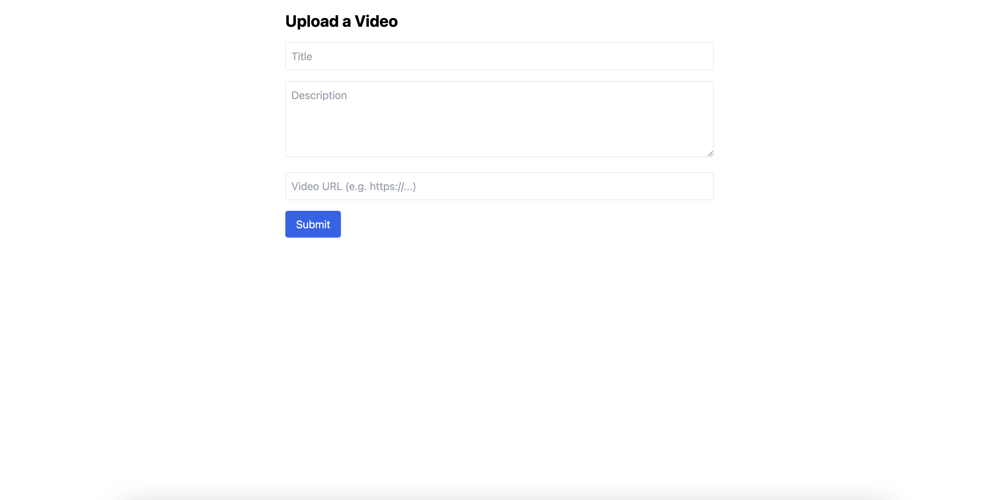
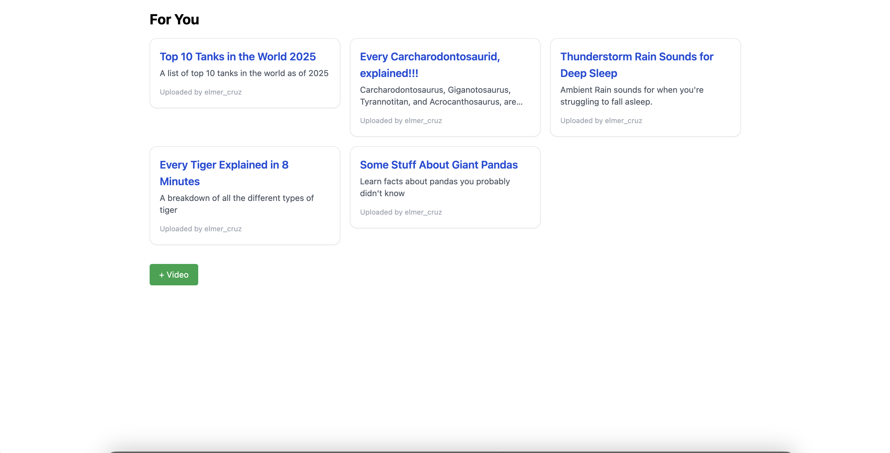

# EduVideo – Scope Labs Take-Home Project

A simple educational video platform where users can:
- Upload and watch videos
- Leave comments
- Edit videos they uploaded
- Control playback (fullscreen, speed, volume)

Built with **Next.js**, **TypeScript**, **Tailwind CSS**, and `react-player`.

---

## Features

- **Video Feed**: View a list of videos uploaded by a specific user
- **Upload Form**: Create a new video with title, description, and URL
- **Video Player**: Fullscreen-enabled, responsive, with playback speed & volume controls
- **Commenting**: Add and view comments for any video
- **Edit Video**: Editing of your own videos
- **User Identity**: Controlled via a hardcoded `user_id` (`elmer_cruz`)

---

## Design Decisions

- `user_id` is hardcoded to `"elmer_cruz"` for simplicity
- All API calls are routed through local `/api/proxy/*` routes to avoid CORS issues
- Componentized architecture for clean separation of concerns

---

## Technologies Used

- **Next.js + TypeScript**
- **Tailwind CSS**
- **React Player**
- **Proxy-based API integration**

---

## Screenshots

| Upload Page | Video Detail Page | Comments Section |
|-------------|-------------------|------------------|
|  |  |  |


---

## How to Run Locally

```bash
git clone https://github.com/cruzeht915/edu-video-app.git
cd edu-video-app

npm install
npm run dev
```

Then open http://localhost:3000 in your browser.

## API Integration

All API requests are routed through `/api/proxy/*` to avoid CORS issues with the official backend:

```
https://take-home-assessment-423502.uc.r.appspot.com
```

Example proxy:
```
/api/proxy/videos?user_id=elmer_cruz
```

---

##  Project Structure

/pages
  index.tsx            → homepage (video list)
  upload.tsx           → upload form
  /videos/[id].tsx     → video detail page

/components
  VideoCard.tsx
  VideoPlayer.tsx
  CommentList.tsx
  CommentForm.tsx
  EditVideoForm.tsx
  Modal.tsx

/lib
  api.ts               → all API helper functions using proxy routes


---

## Deployment

This app is deployable to [Vercel](https://vercel.com/) out of the box with no config required.

---

## Author

Built by Elmer Cruz as part of the Scope Labs take-home challenge.

GitHub: [@cruzeht915](https://github.com/cruzeht915)
